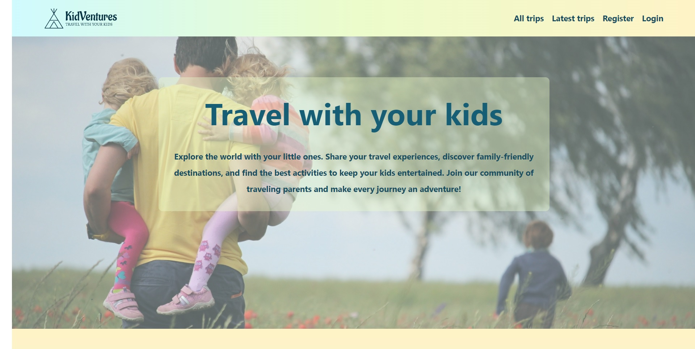
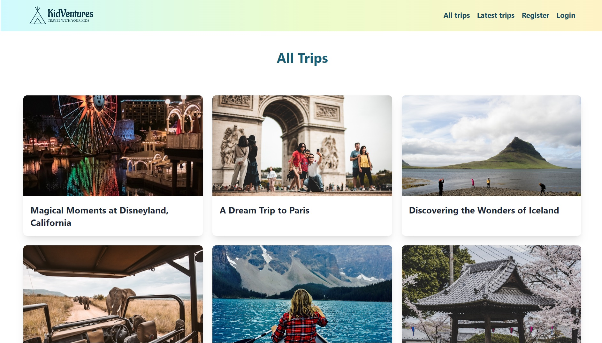
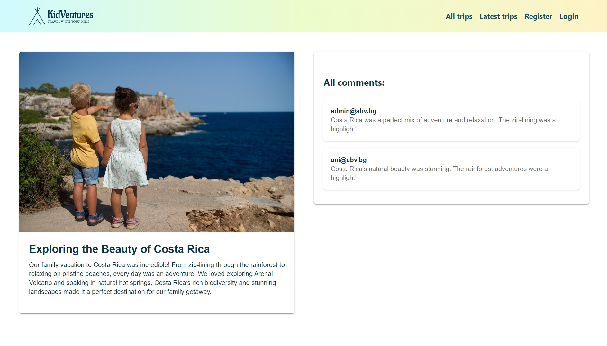
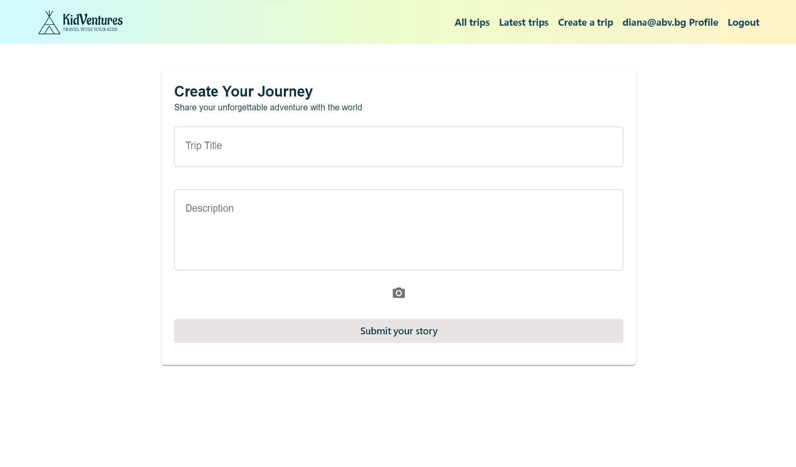
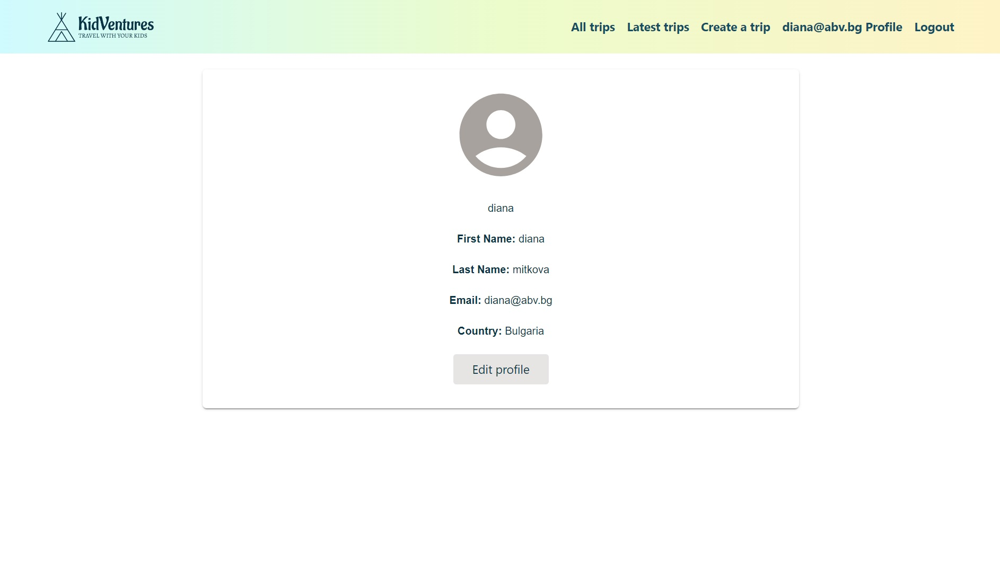

# 🌟 KidVentures 🌟

<div align="center">
  
</div>

### 🚀 https://kidventures-blog.web.app

## 📝 Description
**KidVentures** is your ultimate travel blog for discovering destinations and exciting activities perfect for traveling with kids. Whether you're seeking inspiration for your next family adventure or looking to share your own experiences, KidVentures is the ideal platform.

## ✨ Features

### 🌍 Guest Features:
- **🏠 Home Page**: Explore recent trips and a comprehensive list of all trips.
- **📜 All Trips**: Browse through our extensive list of trips.
- **🆕 Recent Trips**: Stay updated with the latest adventures shared by the community.
- **📝 Trip Details**: Detailed pages for each trip, complete with a comment section to read and leave comments.
- **🔐 Login Page**: Access your account.
- **🆕 Register Page**: Create a new account to join our community.

### 👤 Logged-in User Features:
- **👤 Profile**: Manage your personal information and settings.
- **📝 Create a Trip**: Share your adventures with the community.
- **🔍 Detailed Trip Pages with Exclusive Functionalities**:
  - ⭐ Add to favorites.
  - 💬 Add a comment.
  - ✏️ If you are the owner:
    - Edit your trips.
    - Delete your trips.
- **🚪 Logout**: Securely sign out from your account.

### ✅ Registration Data Validation:
- Ensure accurate and valid registration data for a smooth user experience.

## 🚀 Installation Instructions

KidVentures is deployed on Firebase, but if you need to run it locally, follow these steps:

1. **Client Setup:**
   - Navigate to the client folder:
     ```bash
     cd client
     npm run dev
     ```
   - Open your browser and go to [http://localhost:5173/](http://localhost:5173/)

2. **Server Setup:**
   - Navigate to the server folder:
     ```bash
     cd server
     firebase serve
     ```
   - Open your browser and go to [http://localhost:5000/kidventures-blog/us-central1/api](http://localhost:5000/kidventures-blog/us-central1/api)

## 🖼️ Screenshots

 
 
  
  
 

## 🛠️ Technologies Used

- **ReactJS**
- **Vite**
- **TailwindCSS**
- **Bootstrap**
- **Material UI**

## 📜 License

This project is developed for practice purposes and serves as the final project for the ReactJS-June 2024 course at SoftUni.

---

✨ *Happy Travels and Adventures!* ✨
